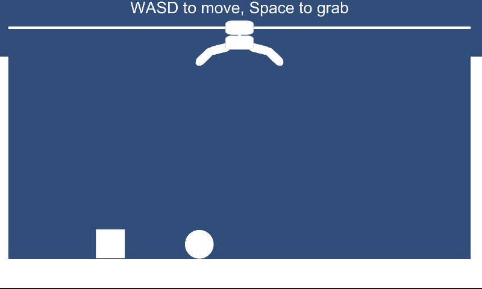

# HandManipulator2D
Simple implementation of a robotic hand manipulator in 2D by Unity physics.

Uses SliderJoint2D to move manipulator's base horizontally and head vertically. Uses HingeJoint2D to rotate fingers.

